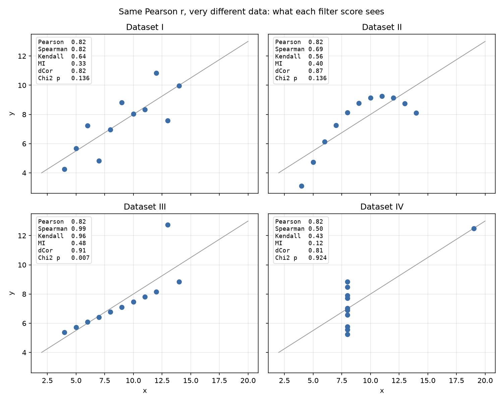

# Feature-selection pitfalls on Anscombe's quartet

Filter feature-selection methods rank features by a single score, such as a correlation coefficient, a
mutual-information estimate or a test statistic. Anscombe's quartet is four 11-point datasets that share
the same Pearson correlation (0.816) while looking completely different.

This repository compares how common filter scores behave on the quartet and where each one can mislead.



## Results

| Dataset | Pearson r | Spearman ρ | Kendall τ-b | Mutual info | Distance corr. | χ² p (median split) | Fisher exact p |
|---|---|---|---|---|---|---|---|
| I   | 0.816 | 0.818 | 0.636 | 0.329 | 0.824 | 0.136 | 0.080 |
| II  | 0.816 | 0.691 | 0.564 | 0.403 | 0.869 | 0.136 | 0.080 |
| III | 0.816 | 0.991 | 0.964 | 0.481 | 0.907 | 0.007 | 0.002 |
| IV  | 0.817 | 0.500 | 0.426 | 0.121 | 0.807 | 0.924 | 0.455 |

Findings:

- **Pearson** cannot tell the four datasets apart.
- **Distance correlation** stays in a narrow band (0.81–0.91). It detects dependence everywhere, but it gives no warning that dataset IV is driven by a single point.
- **Spearman and Kendall** are robust to the outlier in III, but penalise IV heavily because of its ten tied x values.
- **Chi-square after a median split** scores I and II identically, because binarising throws away the curvature of II. With n = 11 most expected counts are below 5, so the approximation is unreliable. Fisher's exact test gives noticeably different p-values.
- **Mutual information** (k-NN estimator) is the only score that clearly flags IV as weak. It is also the noisiest:
  - it shifts by about 0.02 between random seeds
  - its value on dataset III moves by about 0.5 depending on which single point is left out
- **Leave-one-out check:** removing the one point at x = 19 in dataset IV makes x constant, and every score becomes undefined. None of the full-sample scores reveals this dependence on a single observation.

**Takeaway:** a single filter score is not enough to judge a feature. Combine a linear and a rank-based score, check stability with a leave-one-out pass, and plot the data.

## Repository layout

```
anscombe_fs/            measures.py (all scores + leave-one-out), plots.py
data/anscombe.csv       the quartet, long format (dataset, x, y)
notebooks/              anscombe_feature_selection.ipynb – narrative walkthrough
scripts/run_all.py      regenerates results/ and figures/
results/                scores.csv, leave_one_out.csv, mutual_information_stability.csv
tests/                  pytest checks (incl. values from the original analysis)
```

## Quick start

```bash
pip install -r requirements.txt
python scripts/run_all.py      # tables + figures
pytest                         # sanity checks
jupyter notebook notebooks/anscombe_feature_selection.ipynb
```

Or in your own code:

```python
from anscombe_fs import load_anscombe, score_table
score_table(load_anscombe())
```

## Reference

F. J. Anscombe, "Graphs in Statistical Analysis", *The American Statistician*, 27(1):17–21, 1973.

## License

MIT, see [LICENSE](LICENSE).
